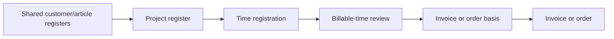

# Fortnox Time core workflow: evidence and MVP recommendation

**Research date:** 2026-07-15  
**Decision context:** consulting-time MVP map  
**Source policy:** first-party, public Fortnox product-help pages only

## Executive summary

Fortnox Time (`Fortnox Tid` in the Swedish sources) implements a longer accounting-oriented chain than this MVP needs:

1. create customers, service articles, and projects in shared Fortnox registers;
2. record worked and billable hours against a customer/project/service combination;
3. inspect and select accumulated billable registrations for a date range;
4. move selected registrations into a customer invoice/order basis, adjust it, and finally create an invoice/order in another Fortnox module.

That sequence is directly described in Fortnox's getting-started checklist and detailed help pages. Fortnox also has optional day “ready” marking, monetary prices, service articles, projects, materials/expenses, invoice templates, fixed-price handling, invoices, orders, and payroll-related behavior. Those are not necessary to preserve the central product idea for the deliberately smaller MVP. [Fortnox: Kom igång med Fortnox Tid](https://support.fortnox.se/produkthjalp/tid/kom-igang-med-fortnox-tid) [Fortnox: Debiterbar tid](https://support.fortnox.se/produkthjalp/tid/debiterbar-tid) [Fortnox: Faktura-/orderunderlag i Fortnox Tid](https://support.fortnox.se/produkthjalp/tid/faktura-orderunderlag-i-fortnox-tid)

**Recommendation:** retain the spine **Client → Time Entry → period review → hours-only Invoice Basis**. Simplify Fortnox's separate worked/billable-hour quantities to the MVP's explicit billable/non-billable classification unless the domain-model ticket finds a real need for partial write-downs. Exclude the accounting, project, service-article, formal readiness, monetary, mobile, payroll, and invoice-generation layers.

## Terminology and evidence boundary

The sources use Swedish product terms. For this decision input:

- `kund` is mapped to the canonical **Client**;
- a Fortnox time registration is discussed as a **Time Entry**;
- `fakturaunderlag` is mapped to **Invoice Basis**;
- Fortnox's configurable users/permissions are not treated as proof of the MVP's **Member** and **Administrator** roles.

This mapping is editorial, not a claim that Fortnox uses the MVP's domain model. All sections headed **Current-product facts** report sourced behavior. Text explicitly labelled **Inference** or **Recommendation** is analysis for the MVP, not a Fortnox fact.

## End-to-end current workflow

Fortnox's official checklist orders setup and use as: review permissions, review Time settings, add customers and articles, add projects, register time/absence/other items, then invoice from the **Debiterbar tid** tab. The same page says the billable-time view converts users' registrations into order or invoice bases, which can then be adjusted before an order or invoice is created. [Fortnox: Kom igång med Fortnox Tid](https://support.fortnox.se/produkthjalp/tid/kom-igang-med-fortnox-tid)

The project and article steps are Fortnox facts, but they are intentionally not part of the target MVP destination.

## 1. Client setup

### Current-product facts

- Time registrations use customers and articles from Fortnox's shared registers. A user creates them through **Register**, using **Create customer** or **Create article**. Only articles typed as services appear for time registration; goods articles are used for “other” registrations. [Fortnox: Kom igång med Fortnox Tid](https://support.fortnox.se/produkthjalp/tid/kom-igang-med-fortnox-tid)
- In the general customer register, **customer number** and **customer name** are mandatory. Email, customer type, industry code, payment terms, price list, VAT type, and other invoicing information may also be stored. Fortnox says customer data can later be changed or completed. [Fortnox: Skapa ny kund](https://support.fortnox.se/produkthjalp/fakturering/skapa-ny-kund)
- During Time Entry creation, the user first selects a customer by searching part of its name or number. If the customer does not exist, an orange plus opens a new tab in which it can be created. Project and service are then selected similarly. [Fortnox: Att registrera tid, frånvaro och övrigt i Fortnox Tid](https://support.fortnox.se/produkthjalp/tid/att-registrera-tid-franvaro-och-ovrigt-i-fortnox-tid)
- Projects also come from a shared register. A project can constrain which services are selectable and which customers it is tied to, affecting the choices available during time registration. [Fortnox: Kom igång med Fortnox Tid](https://support.fortnox.se/produkthjalp/tid/kom-igang-med-fortnox-tid)

### What the public sources do not establish

- The Time help does not establish which customer fields, beyond the general register's number and name, are needed merely to record time rather than ultimately invoice.
- These pages do not establish duplicate-detection rules, deletion rules, the complete customer lifecycle, or how historical Time Entries behave when a customer is inactivated.
- They do not establish that ordinary time reporters may create customers in every permission configuration. The inline plus is documented, but its interaction with all permission combinations is not.

### MVP inference

Fortnox separates the reusable customer identity from Time Entries and makes the customer selectable at entry time. That is the useful concept. Its service-article and project registers exist to support a broader billing/accounting product and should not be copied into a map that expressly places Time Entries directly against Clients.

## 2. Time registration

### Current-product facts

- The **Registrering** tab is the central place where registrations are made, collected, and managed. Desktop users can view a day, five-day interval, or week and navigate to a specific date. Fortnox also supports mobile-app registration. [Fortnox: Att registrera tid, frånvaro och övrigt i Fortnox Tid](https://support.fortnox.se/produkthjalp/tid/att-registrera-tid-franvaro-och-ovrigt-i-fortnox-tid)
- Creating a time registration exposes date, optional cost centre, customer/project/service, registration code, worked hours, billable hours, invoice text, and an internal note. Today's date is proposed. Billable hours initially equal worked hours but may be adjusted upward or downward. Invoice text follows the registration to the order/customer invoice; internal notes never appear on order or invoice bases. [Fortnox: Att registrera tid, frånvaro och övrigt i Fortnox Tid](https://support.fortnox.se/produkthjalp/tid/att-registrera-tid-franvaro-och-ovrigt-i-fortnox-tid)
- Existing customer/service rows can seed another registration: clicking the relevant date cell opens a prefilled registration, and changing the prefilled dimensions creates a new table row. Fortnox also supplies a timer that records start/stop time and derives worked and billable time. A timer cannot cross midnight; that requires two registrations. [Fortnox: Att registrera tid, frånvaro och övrigt i Fortnox Tid](https://support.fortnox.se/produkthjalp/tid/att-registrera-tid-franvaro-och-ovrigt-i-fortnox-tid)
- A registration can ordinarily be opened, edited, or deleted. Fields can be locked when the registration is already on an Invoice Basis or its day is marked ready. [Fortnox: Att registrera tid, frånvaro och övrigt i Fortnox Tid](https://support.fortnox.se/produkthjalp/tid/att-registrera-tid-franvaro-och-ovrigt-i-fortnox-tid)
- “Ready” marking covers all registrations through a chosen date and locks those dates. It can be rolled back. The billable-time screen warns if users have not marked time ready, but Fortnox explicitly says the warning does not prevent creation of an Invoice Basis. [Fortnox: Att registrera tid, frånvaro och övrigt i Fortnox Tid](https://support.fortnox.se/produkthjalp/tid/att-registrera-tid-franvaro-och-ovrigt-i-fortnox-tid)

### What the public sources do not establish

- They do not specify time precision, rounding, overlap validation, maximum duration, future-date policy, timezone behavior, concurrent-edit behavior, or a complete audit trail.
- They do not establish whether customer, project, and service are universally mandatory in every configuration; the help describes the selection flow but not a field-level validation contract.
- “Ready” marking is documented as a lock plus a non-blocking warning, not as formal approval. The sources provide no approve/reject state here.

### MVP inference

The core is manual, dated hours attached to a Client, with an optional explanation and an explicit billing treatment. Prefilled rows and timers are productivity aids, not prerequisites for the domain model. Fortnox's separate `worked hours` and `billable hours` allow partial write-ups/write-downs; the map's simpler billable/non-billable scope does not itself justify two hour quantities.

## 3. Review of billable time

### Current-product facts

- Fortnox accumulates registered time under **Debiterbar tid**. The reviewer chooses a date interval and can further filter by customer, project, and service. Opening a table row reveals the underlying registrations after filtering; Fortnox states that the displayed registrations are what will be included in the order or Invoice Basis. [Fortnox: Debiterbar tid](https://support.fortnox.se/produkthjalp/tid/debiterbar-tid)
- A reviewer can mark particular registrations “never invoice.” They move to a **Faktureras ej** section and are no longer available for invoicing. For time registrations, worked time remains in statistics while billable time becomes zero. The action is reversible: selected registrations can be returned to billable time. [Fortnox: Debiterbar tid](https://support.fortnox.se/produkthjalp/tid/debiterbar-tid)
- To create a basis, the reviewer checks the desired rows and clicks **Create invoice basis**. Warnings such as users not marking time ready are advisory rather than blocking. Creation moves the registrations from **Debiterbar tid** to **Fakturaunderlag**. [Fortnox: Debiterbar tid](https://support.fortnox.se/produkthjalp/tid/debiterbar-tid)
- Access to create order/invoice bases is permission-controlled. Fortnox says granting such access adds the **Debiterbar tid** and **Fakturaunderlag** tabs. It also says a user with this permission can see colleagues' registrations in detailed overview because colleagues may report time for customers the user can invoice. [Fortnox: Kom igång med Fortnox Tid](https://support.fortnox.se/produkthjalp/tid/kom-igang-med-fortnox-tid)

### What the public sources do not establish

- The articles do not provide a full authorization matrix that maps cleanly to the MVP's Member and Administrator roles.
- They do not establish an approve/reject workflow, review comments, reviewer assignment, mandatory completeness gates, or period closure. In fact, the documented ready-marking warning is bypassable.
- They do not state a stable API-like grouping key for rows in the billable-time table. Screenshots and prose show customer/project/service filtering, but that is not enough to infer exact aggregation semantics.

### MVP inference

The transferable pattern is a period-scoped administrative queue with drill-down to source Time Entries and explicit inclusion in an Invoice Basis. A separate formal approval state would add workflow Fortnox does not require here and the MVP map explicitly excludes.

## 4. Invoice Bases

### Current-product facts

- Created bases appear on the **Fakturaunderlag** tab (or **Orderunderlag**, depending on settings). Fortnox groups them by status: all, started (no customer invoice created), transferred (invoice created and transferred to invoicing/order), and cancelled. [Fortnox: Faktura-/orderunderlag i Fortnox Tid](https://support.fortnox.se/produkthjalp/tid/faktura-orderunderlag-i-fortnox-tid)
- On a started Invoice Basis, a template controls the information and order shown on the eventual customer invoice. A reviewer can edit invoice text and adjust price or billable time. Fortnox says changing billable time here also changes the underlying time registration. A row can be removed from the basis and returned to **Debiterbar tid** for later billing. [Fortnox: Faktura-/orderunderlag i Fortnox Tid](https://support.fortnox.se/produkthjalp/tid/faktura-orderunderlag-i-fortnox-tid)
- Fortnox additionally supports combining/separating article lines, hiding zero-billable-time lines, fixed-price bases, project summaries, tax-deduction constraints, and monetary contribution calculations. [Fortnox: Faktura-/orderunderlag i Fortnox Tid](https://support.fortnox.se/produkthjalp/tid/faktura-orderunderlag-i-fortnox-tid)
- Clicking **Create invoice** converts a completed basis into a customer invoice in Fortnox Invoicing; multiple bases can be converted in bulk. The basis then changes from started to transferred and retains a link to the created invoice/order. [Fortnox: Faktura-/orderunderlag i Fortnox Tid](https://support.fortnox.se/produkthjalp/tid/faktura-orderunderlag-i-fortnox-tid)
- The time-entry help independently says fields may become locked when a registration is included on an Invoice Basis, cross-checking that basis membership affects later editability. [Fortnox: Att registrera tid, frånvaro och övrigt i Fortnox Tid](https://support.fortnox.se/produkthjalp/tid/att-registrera-tid-franvaro-och-ovrigt-i-fortnox-tid)

### What the public sources do not establish

- The pages do not define Invoice Basis immutability or snapshot semantics precisely. They document editable billable time, returning rows, status changes, and locks, but not every mutation allowed at each state.
- They do not establish a simple hours-only basis shape because Fortnox's basis is explicitly designed to become a priced invoice/order with articles and money.
- They do not provide an authoritative rule for one basis per Client and period, overlapping periods, duplicate inclusion under concurrency, or whether a transferred/cancelled basis can ever be deleted.
- Fortnox's `started/transferred/cancelled` statuses are tied to downstream invoice/order production. They should not be imported unchanged into an MVP that does not create invoices.

### MVP inference

For this map, the Invoice Basis should be the endpoint, not a staging object for an invoice. Its value is traceability: a chosen Client, explicit period, included source Time Entries, per-Member and total hours, and a reviewable state. Monetary lines, templates, accounting transfer, and invoice lifecycle are a different bounded problem.

## Decision risks to resolve in the remaining map tickets

These are **not answered by the public Fortnox sources** and require first-party MVP decisions rather than guessed parity:

- the minimal Client identity and active/inactive lifecycle;
- whether non-billable entries can still belong to a Client Invoice Basis or are review-only context;
- whether partial write-downs are needed, and if so whether they mutate a Time Entry or are adjustments owned by an Invoice Basis;
- period boundaries, overlaps, duplicate prevention, and concurrent creation;
- the exact transition that locks a Time Entry, how corrections reopen it, and what audit history is retained;
- whether an Invoice Basis is editable, finalized, replaceable, or versioned after creation;
- grouping and totals (per Member, per day, per Client, and overall) for an hours-only basis.

## Primary-source index

- [Fortnox — Kom igång med Fortnox Tid](https://support.fortnox.se/produkthjalp/tid/kom-igang-med-fortnox-tid) — setup checklist, shared registers, permissions, top-level billing flow; page metadata showed modification on 2026-05-07 when researched.
- [Fortnox — Skapa ny kund](https://support.fortnox.se/produkthjalp/fakturering/skapa-ny-kund) — customer-register creation and fields; page metadata showed modification on 2025-08-26 when researched.
- [Fortnox — Att registrera tid, frånvaro och övrigt i Fortnox Tid](https://support.fortnox.se/produkthjalp/tid/att-registrera-tid-franvaro-och-ovrigt-i-fortnox-tid) — entry fields, worked/billable hours, editing, timers, locks, ready marking; page metadata showed modification on 2025-08-26 when researched.
- [Fortnox — Debiterbar tid](https://support.fortnox.se/produkthjalp/tid/debiterbar-tid) — date/filter review, never-invoice handling, selection and movement into a basis; page metadata showed modification on 2025-08-26 when researched.
- [Fortnox — Faktura-/orderunderlag i Fortnox Tid](https://support.fortnox.se/produkthjalp/tid/faktura-orderunderlag-i-fortnox-tid) — basis statuses, adjustments, returns, fixed-price/accounting features, invoice/order conversion; page metadata showed modification on 2025-08-26 when researched.

## Actionable recommendations

### Retain

1. **One reusable Client record selected by every Time Entry.** This preserves the strongest Fortnox seam: setup once, reference repeatedly, review and bill by Client.
2. **Dated hours plus billable/non-billable treatment and an optional description.** Keep source Time Entries intelligible during later review; keep internal notes separate from any customer-facing description only if the MVP specification identifies both audiences.
3. **Administrator review by explicit date period with drill-down to source Time Entries.** The Administrator must see what will be included before creating an Invoice Basis.
4. **Explicit selection into an Invoice Basis and protection against silent double inclusion.** Fortnox visibly moves selected registrations out of the billable queue and locks entries in some basis/ready states; the MVP needs an equally clear ownership transition, though its exact correction rules belong in the correction/locking ticket.
5. **Traceability from each Invoice Basis line/total back to its Time Entries.** The basis should remain explainable without introducing invoices.

### Simplify

1. **Client setup:** require only the Client identity fields the time workflow needs. Do not copy Fortnox's payment terms, VAT type, price list, distribution, address lookup, or article configuration into the Client contract.
2. **Time Entry dimensions:** record directly against Client. Do not add Fortnox projects, services/articles, cost centres, or registration codes as hidden substitutes for the map's deliberately excluded assignments/projects/activities.
3. **Billing treatment:** prefer one hours quantity plus billable/non-billable classification. Add a second “billable hours” quantity only if a separate domain decision explicitly requires partial write-downs.
4. **Review:** use Administrator review without ready marks, submit/approve/reject states, or per-user completion gates. Make missing/late data visible without inventing formal approval.
5. **Invoice Basis:** make it hours-only and period-based. Use states that describe the MVP's own lifecycle (for example draft/finalized only if later tickets justify them), not Fortnox's invoice-transfer lifecycle.

### Exclude

- service articles, projects, cost centres, registration codes, materials, expenses, mileage, absence, internal-time/payroll coupling, price groups, rates, prices, fixed fees, VAT/tax deductions, invoice templates, monetary totals, profitability, inventory, orders, invoices, payments, exports, accounting integrations, mobile-native workflows, timers, readiness marking, bulk invoice creation, and Fortnox parity;
- Fortnox's started/transferred/cancelled basis status model where it exists only to track downstream invoices/orders;
- formal approval, because the map excludes it and the Fortnox evidence here shows only a reversible ready lock with a bypassable warning rather than a required approval gate.

